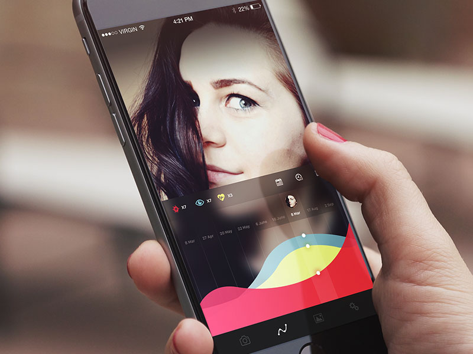
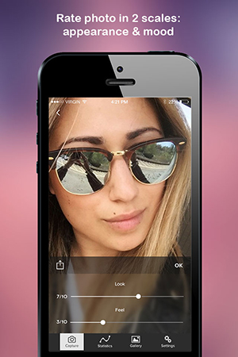
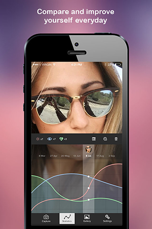
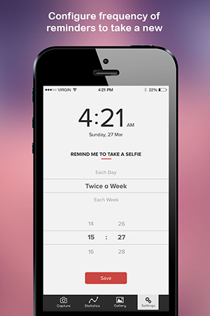

# Aizek
Selfie app with personal timeline tracking, iPhone, iPad

Take a selfie

Apply effects

Rate your photo

See how your self-esteem changes across the time

Filter for photoes in date range

Configure reminders

Code is a piece of shit, sorry... I'm not an author of code. The designer on the other hand did a great job! 
